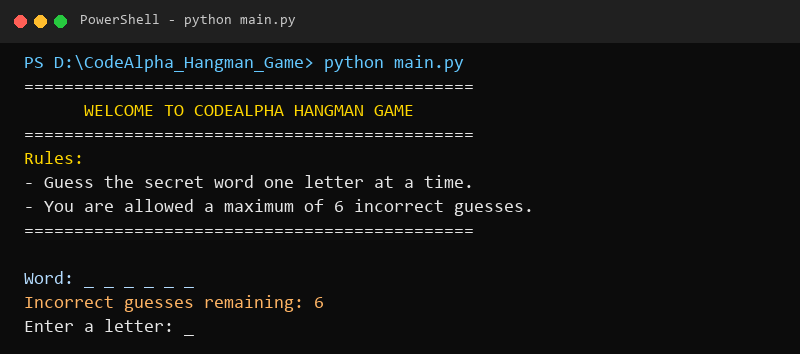
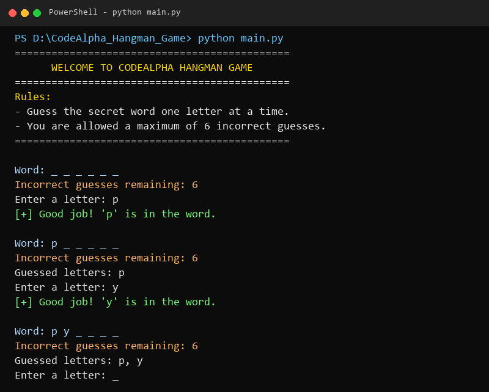
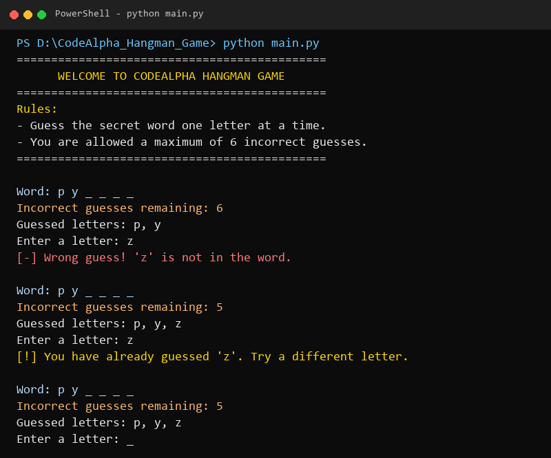
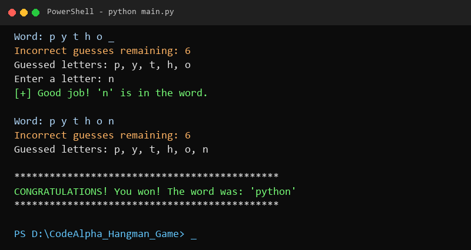
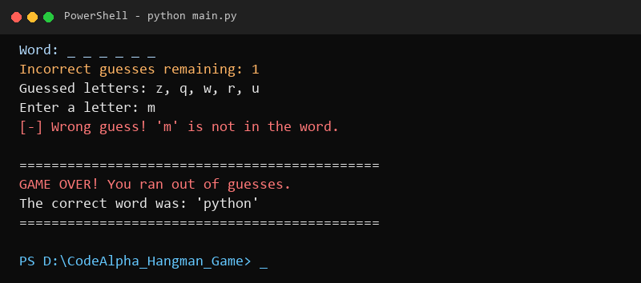

# CodeAlpha Python Programming Internship – Task 01: Hangman Game

A clean, beginner-friendly text-based **Hangman Word Guessing Game** built in Python as part of the **CodeAlpha Python Programming Internship (Task 1)**.

---

## 📖 Project Overview

Hangman is a classic word-guessing game where the computer selects a secret word at random from a predefined list, and the player attempts to uncover it by guessing one letter at a time. The player must deduce the word before running out of their allowed incorrect attempts (maximum of 6).

This implementation focuses on clean logic, standard Python constructs, robust input validation, and clear console user feedback.

---

## ✨ Features

- **Random Word Selection**: Selects a secret word dynamically from a predefined 5-word list (`python`, `computer`, `college`, `coding`, `developer`) using Python's `random` module.
- **Progressive Word Display**: Visualizes the word status with underscores (`_ _ _ _ _`) that get replaced by correctly guessed letters in their exact positions.
- **Strict Input Validation**: Validates user inputs to ensure only single alphabetical characters (`a-z`) are accepted.
- **Duplicate Guess Protection**: Detects previously guessed letters and prompts the player without deducting remaining chances.
- **Attempt Tracking**: Tracks and displays remaining incorrect guesses (out of 6 allowed) after each turn.
- **Win & Game-Over Handling**: Displays an enthusiastic winning banner upon full word discovery or a game-over screen with the revealed word if attempts run out.
- **Pure Standard Python**: Zero external dependencies—runs seamlessly in any Python 3 environment.

---

## 🛠️ Technologies Used

- **Language**: Python 3
- **Standard Library Modules**: `random`
- **Concepts**: Loops (`while`), Conditionals (`if-elif-else`), Functions, Strings, Lists

---

## 📋 Requirements

- **Python 3.6+** installed on your system.
- Standard terminal / console (PowerShell, Command Prompt, macOS Terminal, or Linux bash).

---

## 🚀 Installation & Running Instructions

1. **Clone the Repository**:
   ```bash
   git clone https://github.com/nihitchoudhary690-sys/CodeAlpha_Python_Internship_Task_1.git
   ```

2. **Navigate to the Project Directory**:
   ```bash
   cd CodeAlpha_Python_Internship_Task_1
   ```

3. **Run the Game**:
   ```bash
   python main.py
   ```

4. **Gameplay**:
   - Type a single letter and press `Enter`.
   - Keep guessing until you complete the word or use up all 6 incorrect attempts!

---

## 📂 Project Structure

```text
CodeAlpha_Hangman_Game/
│
├── main.py                     # Main Python game script
├── README.md                   # Project documentation & execution guide
├── .gitignore                  # Git ignore file for bytecode & cache
└── screenshots/                # Terminal output screenshots
    ├── game_start.png          # Game initialization and rules
    ├── correct_guess.png       # Correct letter guessing display
    ├── incorrect_guess.png     # Incorrect guess and remaining attempts
    ├── game_won.png            # Winning game outcome screen
    └── game_over.png           # Game-over outcome screen with revealed word
```

---

## 📸 Screenshots

### 1. Game Start


### 2. Correct Letter Guess


### 3. Incorrect Letter Guess & Remaining Attempts


### 4. Winning Outcome


### 5. Game-Over Outcome


---

## 🎯 Conclusion

This project successfully fulfills all the requirements of **Task 1: Hangman Game** for the **CodeAlpha Python Programming Internship**. It demonstrates foundational programming paradigms in Python including flow control, data structures, state management, and user interaction through a clean and resilient console application.
